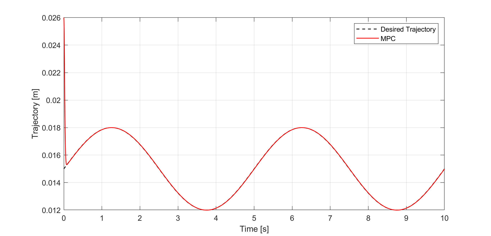
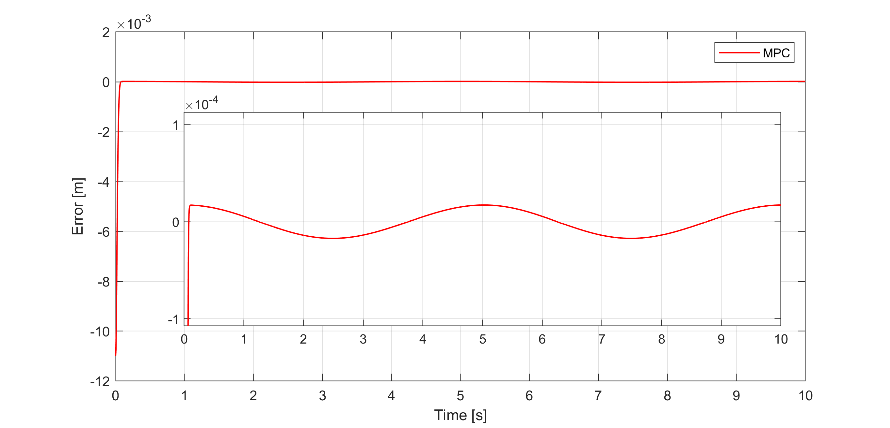
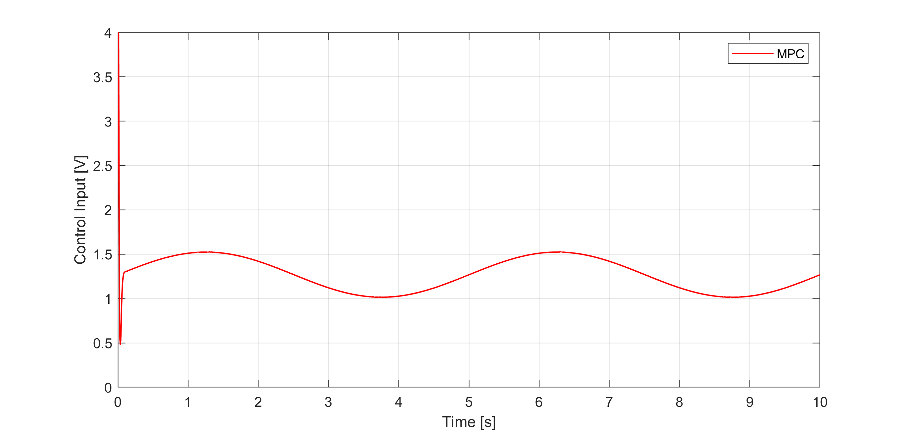

# MPC_for_Magnetic_Levitation_System
Model Predictive Control (MPC)  for Magnetic Levitation Systems

# Description of Magnetic Levitation System

An MLS is illustrated in Fig. 1, consisting of four main components: a metal sphere (with mass $m$), an infrared sensor (transmitter and detector), a controller, and an actuator (comprising an electromagnet and power amplifier). The metal sphere is primarily controlled via the current in the electromagnetic coil $I$, which generates the electromagnetic force $F(y, I)$. This force depends on the coil current $I$ and the distance $y$, enabling the control of the metal sphere's vertical motion under the influence of both electromagnetic force and gravity.

The nonlinear model of an MLS is expressed as follows:

$$
\ddot{y} = g - \frac{\psi }{{y^2}} U^2
$$

where $g$ is the gravitational acceleration, and $\psi  = \frac{\chi K^2}{m}$. Here, $\chi$ is a constant depending on the electromagnet coil parameters, $K = I/U$ is a linear relation constant between the winding current and input voltage, and $U$ is the control input.

The goal is to design an optimal control input $U$ that guides the actual joint position $q$ to match the target trajectory $q_d \in R^n$.

# MPC Formulation
We begin by defining the system state vector as follows:

$$
x = \begin{bmatrix} y \\ \dot{y} \end{bmatrix}^T
$$

Next, we can express the tracking error as:

$$
e = x - x_d
$$

Here, $x_d = [y^T_d \\ \dot{y}^T_d]^T$ denotes the desired trajectory, where $y_d$ and $\dot{y}_d$ represent the desired position and velocity, respectively.

MPC minimizes the following quadratic cost function over a prediction horizon \( N \):

$$
J = \sum_{k=0}^{N} \left( e ^T Q e + U_k^T R U_k \right)
$$

where:  
- $Q$ is the **state weighting matrix**.  
- $R$ is the **control weighting matrix**.  
- $N$ is the **prediction horizon**.  

The control input is optimized under the constraints:

$$
U_{\text{min}} \leq U_k \leq U_{\text{max}}
$$

MPC solves this optimization problem at every time step and applies only the first control input.

# PseudoCode

Define the number of steps N to predict ahead.

Define time step dt

1. Initial guess for control inputs u0 = zeros(n*N,1) % with n is number of joints
   
2. Define the cost function
   
  x_pred = x
  
  J = 0
  
  for k=1,...,N
  
    u_k = u(n*k-n+1:n*k)
    
    x_pred = x_pred + dt* $[\dot{y}, \ddot{y}]^T$
    
    e = x_pred - x_ref
    
    J = J + e' * Q * e + U_k' * R * U_k; % Compute cost
    
  end for

3.  Optimization options
4.  Solve the optimization problem
5.  Extract only the first control input
6.  Apply to robot manipulator
7.  Back to step 2

# Simulation Results and Discussion

**2-DOF Robot Manipulator**

<>

**Simulation Video** 

**Simulation Results**

|_|
|:---:|
|
|
|

**Discussion**

Examining the simulation outcomes reveals that the actual position trajectory closely follows the desired path. 
Furthermore, the control signal is smooth and aligns with the saturation behavior of the hardware limits.

# Conclusion

# References
1. https://scholar.google.com/citations?user=Mc76hQoAAAAJ&hl=en

